<!-- _class: lead -->

# Chrome Extension 的风险以及 MV3 的变化

### By greatghoul

---

## Chrome Webstore 的整改

- 没有隐私协议
- 请求的 URL 没有使用 https
- 请求的权限过多
- 权限与扩展功能不符
- …
- **限期两周**

---

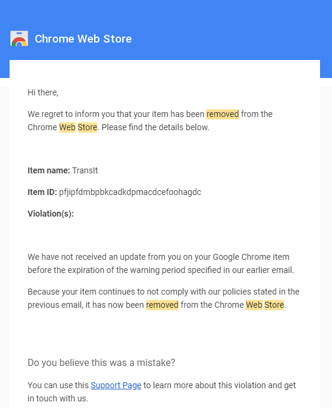

---

## WHY?

- 用户数据 - tabs, geolocation, bookmarks, clipboardRead, ...
- 请求修改和伪装 proxy, webRequest, background ...
- 静默执行 background page, ajax
- 页面注入 contentscript

危险的权限

参考：<a href="https://developer.chrome.com/docs/extensions/mv2/declare_permissions/#manifest">Manifest v2 Permissions</a>

---

## 请求跳转篡改

- "显式"的对请求的页面进行跳转
- 替换请求参数或者地址
- 替换返利链接或者钓鱼
- 短网址欺诈等

---

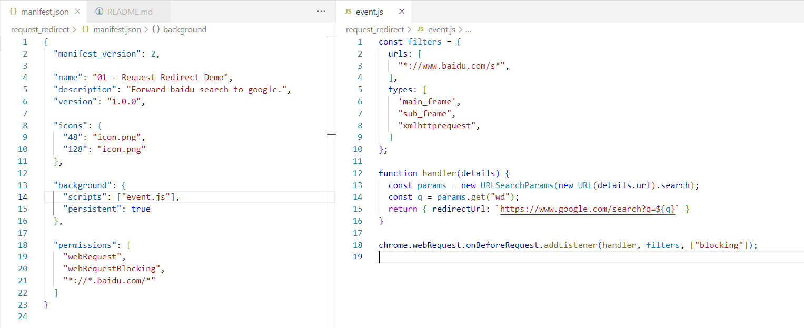

Demo：<a href="https://github.com/greatghoul/chrome-extension-risks-demo/tree/main/01_fake_redirect">01_fake_redirect</a>

---

## 页面媒体内容篡改

- 仍然依赖 redirectUrl 篡改，但是更隐蔽
- 替换页面嵌入的图片等内容，以假乱真
- 例如替换下载二维码、支付二维码等

---

## 请求内容篡改

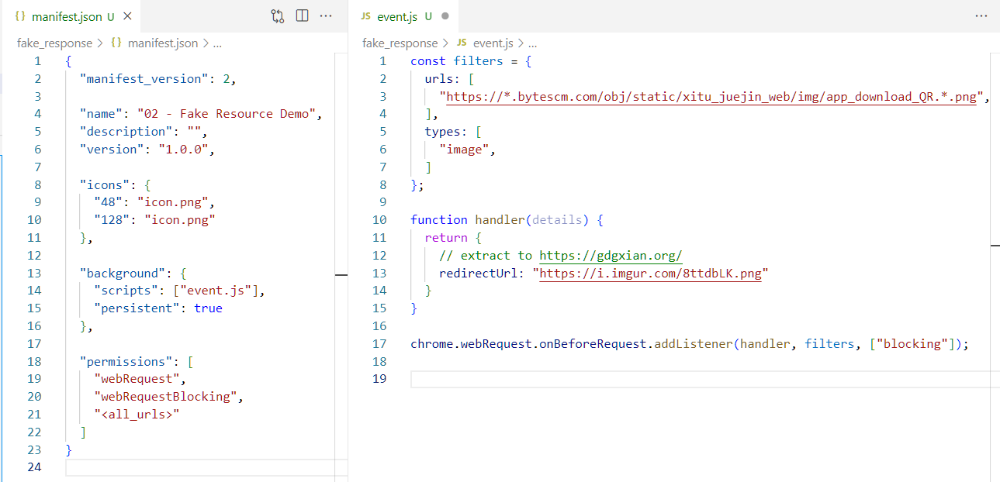

Demo：<a href="https://github.com/greatghoul/chrome-extension-risks-demo/tree/main/02_fake_image">02_fake_image</a>

---

## 脚本内容篡改

- 仍然依赖 redirectUrl 篡改，替换原有 js 内容
- 可以动态按需返回，逃避审查
- 用于表单钓鱼，广告替换等
- 伪装为广告拦截程序

---

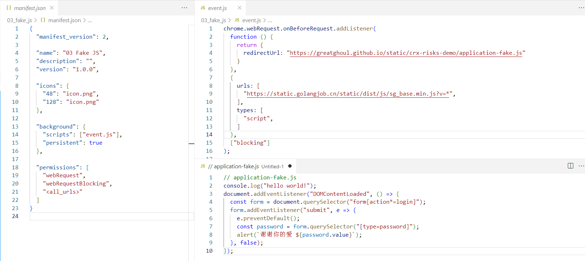

Demo：<a href="https://github.com/greatghoul/chrome-extension-risks-demo/tree/main/03_fake_js">03_fake_js</a>

---

## 后台获取内容

- 使用 background.js
- 自动使用用户的 cookie
- 无法感知
- 偷窃隐私数据

---

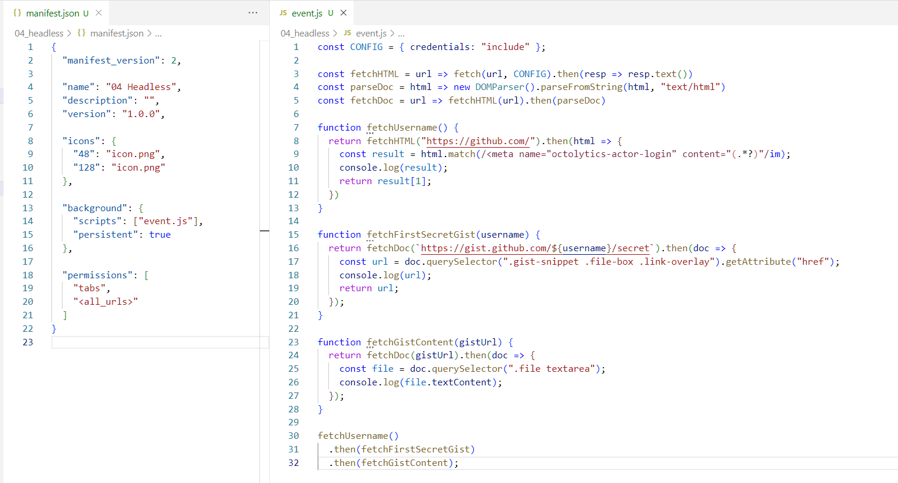

Demo：<a href="https://github.com/greatghoul/chrome-extension-risks-demo/tree/main/04_headless_fetch">04_headless_fetch</a>

---

## 后台发布内容

- 在用户不察觉时静默打开标签页对页面进行操作
- 并不需要很高的扩展权限
- 无需考虑授权的问题
- 窃取信息，伪装发布广告等

---

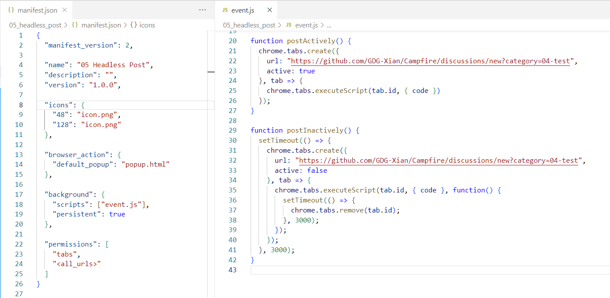

Demo：<a href="https://github.com/greatghoul/chrome-extension-risks-demo/tree/main/05_headless_post">05_headless_post</a>

---

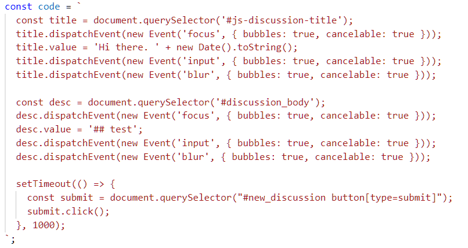

---

## 其它危险行为

- 偷窃和篡改剪贴板
- 篡改代理服务
- 获取地理位置
- 获取浏览历史和书签
- 偷窃和篡改 Cookie
- Content Scripts
- ChromeLoader
- 最危险的是人

---

## 信任危机

当大佬们开始作恶

参考：<a href="https://www.slideshare.net/OlehLevytskyi1/issues-with-chrome-extensions-presentation-owasp-ukraine-2018?qid=712d030c-974b-4d3c-81b9-190568a321c8&amp;v=&amp;b=&amp;from_search=1">Issues with chrome extensions presentation (OWASP Ukraine 2018)</a>

---

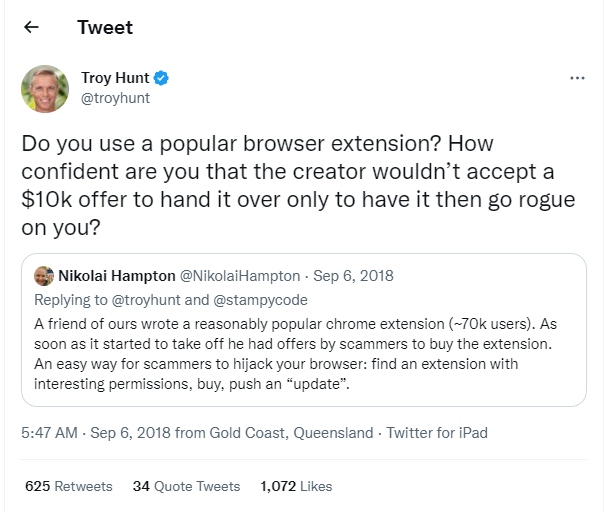

---

## 窥视浏览数据（Stylish）

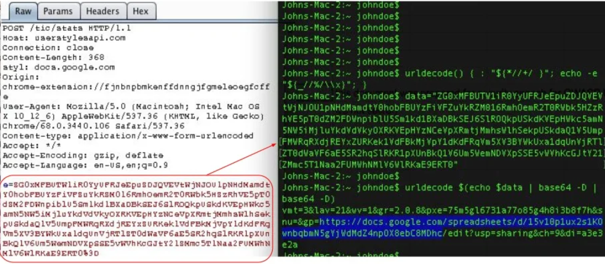

参考：<a href="https://robertheaton.com/2018/07/02/stylish-browser-extension-steals-your-internet-history/">"Stylish" browser extension steals all your internet history</a>

---

## 窥视地址信息（Full Page Screenshot Capture）

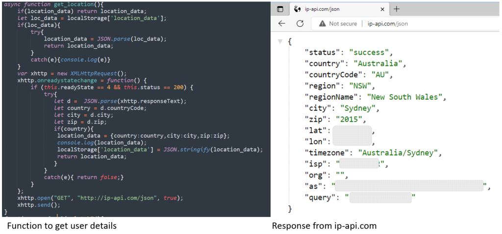

参考：<a href="https://www.mcafee.com/blogs/other-blogs/mcafee-labs/malicious-cookie-stuffing-chrome-extensions-with-1-4-million-users/?AID=11868435&amp;PID=3607085&amp;SID=829611-xid-fr1666016423aaa">Malicious Cookie Stuffing Chrome Extensions with 1.4 Million Users</a>

---

## 篡改请求（Netflix Party）

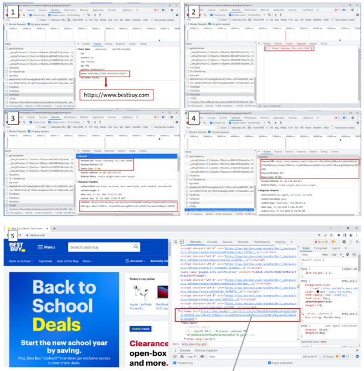

参考：<a href="https://www.mcafee.com/blogs/other-blogs/mcafee-labs/malicious-cookie-stuffing-chrome-extensions-with-1-4-million-users/?AID=11868435&amp;PID=3607085&amp;SID=829611-xid-fr1666016423aaa">Malicious Cookie Stuffing Chrome Extensions with 1.4 Million Users</a>

---

<!-- _class: lead -->

## Manifest V3

### 安全与便捷的平衡

---

## 什么是 Manifest?

- 应用描述文件
- manifest.json
- 描述包含基本信息
- 定义权限和可访问性
- 配置可用的资源，比如图片，脚本

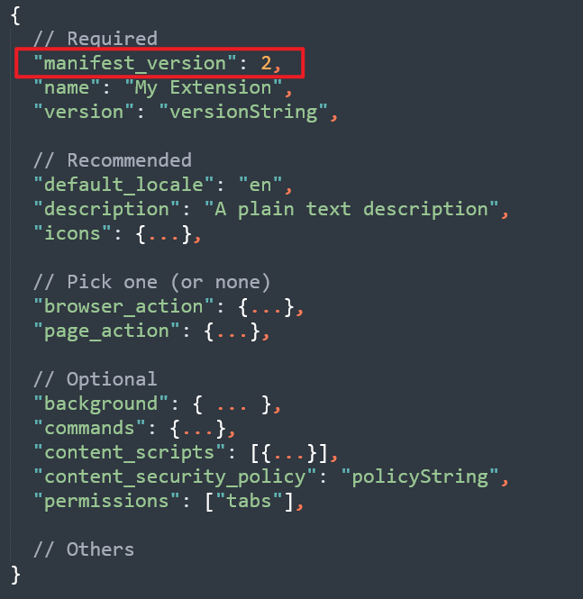

---

## 什么是 MV3?

- manifest.json 的一个大版本更新
- 很多 Breaking Change
- 主攻安全和隐私方向的改善
- 影响大量扩展
- 褒贬不一
- 主流浏览器都在积极跟进

---

## 时间点

| Date | Event |
|------|-------|
| January 17, 2022 | Existing Manifest V2 extensions can no longer be changed from "Private" to "Public" or "Unlisted" |
| June 2022 | Chrome Web Store stops accepting new Manifest V2 extensions with visibility set to "Public" or "Unlisted" |

参考：<a href="https://developer.chrome.com/docs/extensions/mv3/mv2-sunset/">Manifest V2 support timeline</a>

---

## 时间点

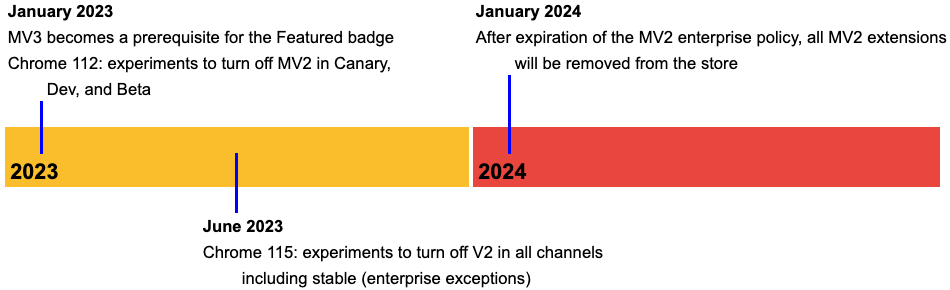

参考：<a href="https://developer.chrome.com/docs/extensions/mv3/mv2-sunset/">Manifest V2 support timeline</a>

---

## 迁移至 MV3 – 版本更新

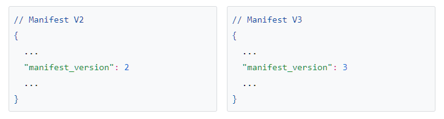

参考：<a href="https://developer.chrome.com/docs/extensions/mv3/mv3-migration/#when-use-blocking-webrequest">Migrating to Manifest V3</a>

---

## 迁移至 MV3 – Service Worker

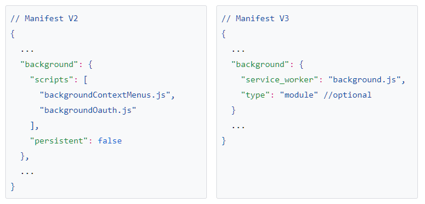

---

## 迁移至 MV3 – Service Worker

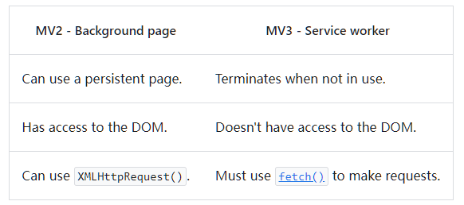

---

## 迁移至 MV3 – Host Permissions

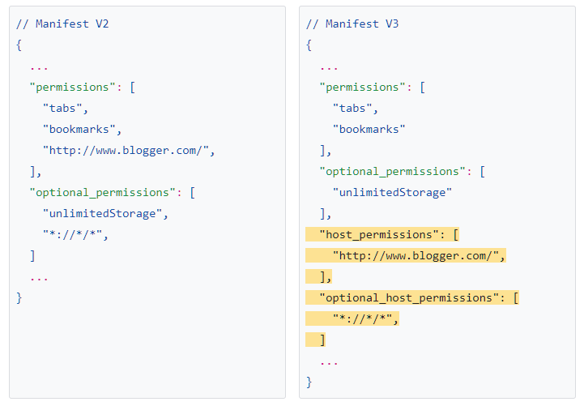

---

## 迁移至 MV3 – 执行代码

- 所以代码逻辑都必须定义在扩展包内
- 不可以执行从服务器下载的代码
- 不可以使用 CDN
- 不可以使用 Eval
- 推荐 scripting.executeScript （受限的功能）

---

## 迁移至 MV3 – 请求修改

- 不再对个人开发者开放 Blocking Web Request → 黑盒
- 推荐使用 DeclarativeNetRequest → 白盒

---

## 哪些扩展受到影响

- TamperMonkey 一类脚本管理工具
- 各种 AddBlocker
- 一些功能复杂的起始页
- 音乐播放器、监控类工具
- 爬虫工具

---

## 建议

- 尽量从 Chrome Webstore 安装扩展
- 安装扩展时，确认请求的权限是否超出应用范围
- 对于直接从源码安装的扩展，再三确认安全再安装
- 定期检查有没有陌生的扩展被安装到自己的浏览器里面
- 使用国内 Chromium 内核的浏览器安装扩展时，需要慎重

---

<!-- _class: lead -->

# Q&A

Thank you