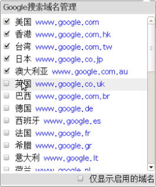
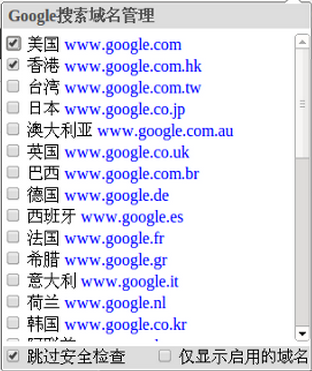
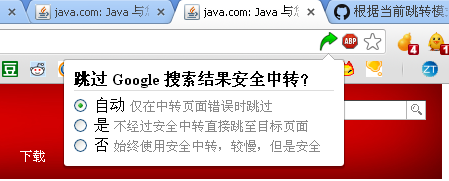

title: Chrome扩展Direct Link开发记录
theme: ../themes/remark-dark.css
name: inverse
layout: true
class: inverse center middle

---

# Chrome扩展Direct Link开发记录
[greatghoul@GDG西安201308]

---

# Direct Link 的开发动机

Google 搜索中间页中间页

    http://www.google.com.hk/url?sa=t&amp;rct=j&amp;q=&amp;esrc=s&amp;
    source=web&amp;cd=1&amp;cad=rja&amp;ved=0CC4QFjAA&amp;
    url=http%3A%2F%2Fbaike.baidu.com%2Fview%2F917695.htm
    &amp;ei=GNyhUNHdGqSQiAfA34DADQ&amp;usg=AFQjCNGyRS1s0m3_WG-PQHipdfaGU0TxTA

---

# 为什么会有中间页？

收集用户数据  
记录 Google 搜索历史  
安全检查  

---

# 自己是第一用户

快速响应  
目的明确  
源动力  
避免过度设计  

---

# V1.1 起点

界面？没有！  
只是为了跳转  
WebRequest / WebRequestBlock  

---

# 猎豹版

Manifest Version: 1 和 2  
基础版本太老  
Browser Action 和 Page Action  
Chromium 百花齐放：枫树、百度 ...  

---

# V1.2 支持更多域名

有了用户选项，不得不设计一个页面，变得复杂  

---

# V1.3 让用户自己选择

安全检查、历史数据、用户感受

---

# V1.4 化繁为简

  
拥抱开源(MIT)、一种态度

.footnote.right[.bold[\*] [ 如何选择开源许可证？][1]]

[1]: http://www.ruanyifeng.com/blog/2011/05/how_to_choose_free_software_licenses.html

---

# 从简单到复杂再到简单

在合适的场景做合适的事

---

# Chrome Webstore 的缺陷

评论和反馈入口混乱  
开发者无法回复用户的评论  
反馈提醒不足  

---

# 其它应用资源

https://github.com/GDG-Xian/crx-direct-link  
http://www.g2w.me/tag/direct-link-crx/  
[Google SSL Privacy Real Link[Chrome/Firefox]](Google SSL Privacy Real Link[Chrome/Firefox])  
[几款干净的去掉转向浏览器应用](http://www.appinn.com/no-redirect/)  
[chrome-redirector](http://code.google.com/p/chrome-redirector/)  
科学上网 :)  

---

name: last-page
template: inverse

## Thank you!
Slideshow created using [remark](http://github.com/gnab/remark).
