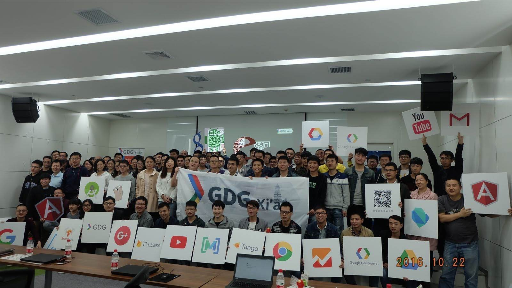
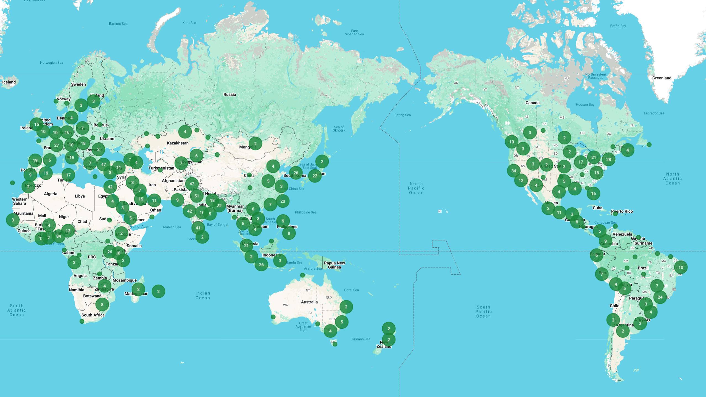
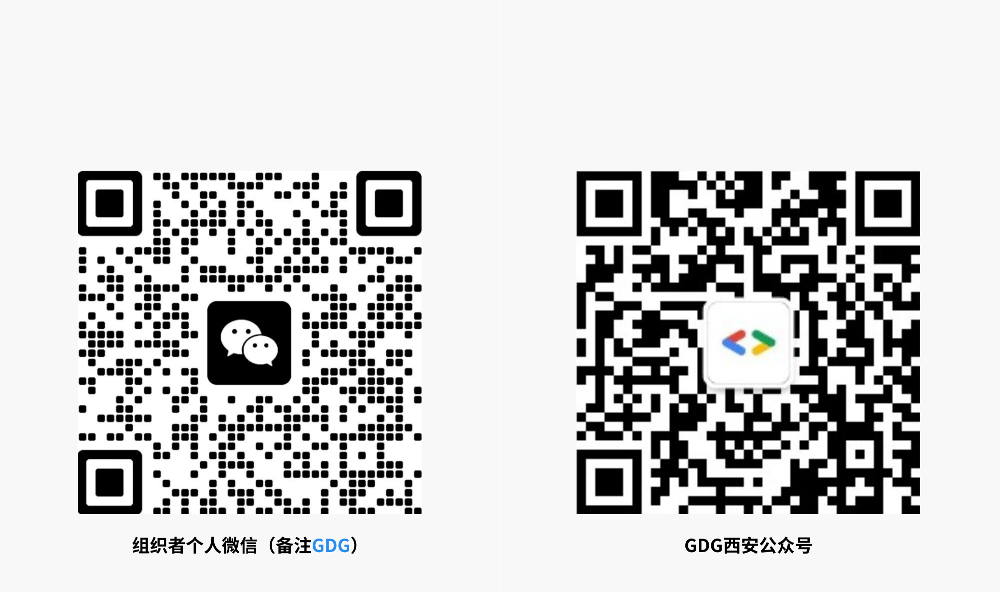

<!-- _class: lead -->

# GDG 西安

### Google Developer Group

🎉 欢迎来到 GDG 西安社区！
这里是西安地区开发者的聚集地

---

## 什么是GDG？

- Google Developer Groups
- 是由Google开发者社区组织的非营利性技术社区
- 致力于连接开发者与技术专家，共同学习和成长
- 专注于分享Google技术和开源技术知识
- 提供开发者交流、学习和成长的平台
- 支持技术创新和行业发展
- 全球超过 1000 个社区，覆盖 140 多个国家
- 中国目前有31个城市创建了GDG社区
---

<!-- footer: GDG 全球社区分布 https://developers.google.com/community -->

---

## GDG西安社区介绍

- 成立于2012年8月4日，是 Google 开发者社区全球大家庭的一员
- 专注于Google开发技术和开源技术分享
- 讨论的技术领域：Android、Dart、Angular、Cloud Computing等
- 活动形式：技术分享会、工作坊 (Codelab)、DevFest、Google I/O 直播、Google I/O Extended、社区说、社区聚会
- 通常每隔几个月在周六下午进行活动
<!-- footer: "" -->
---

## 加入我们

---

## 微信群

- 三个技术讨论群
  - 禁止一切广告
  - 并且招聘有严格限制（见公告）
  - 原创技术文章分享
- 互助群
  - 可以发广告，但不要刷屏
  - 一般不讨论技术
  - 可以随时进出

---

## 成为讲师

- 联系我们，申请成为讲师
- 经验不限，专家和新手皆可
- 开源开放的技术（Google的优先）

